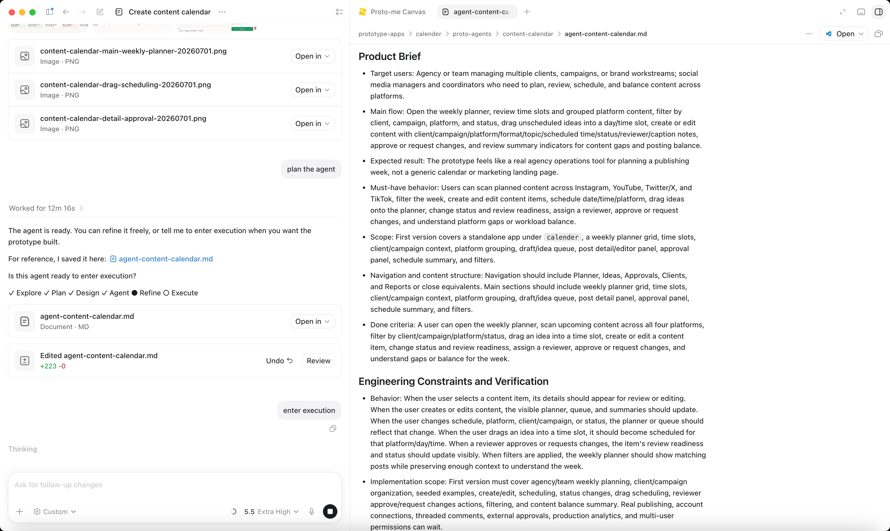
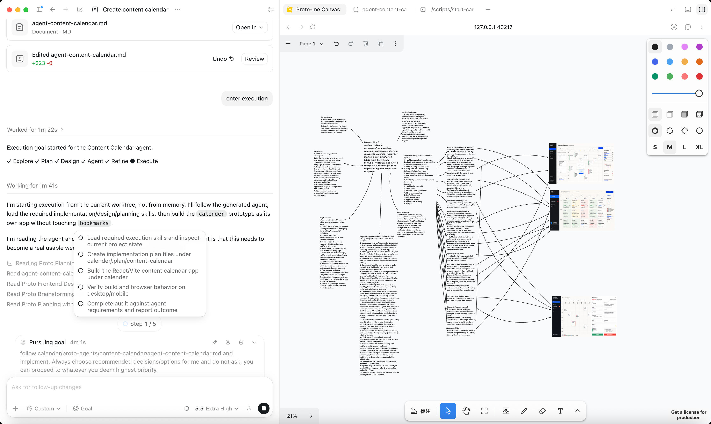
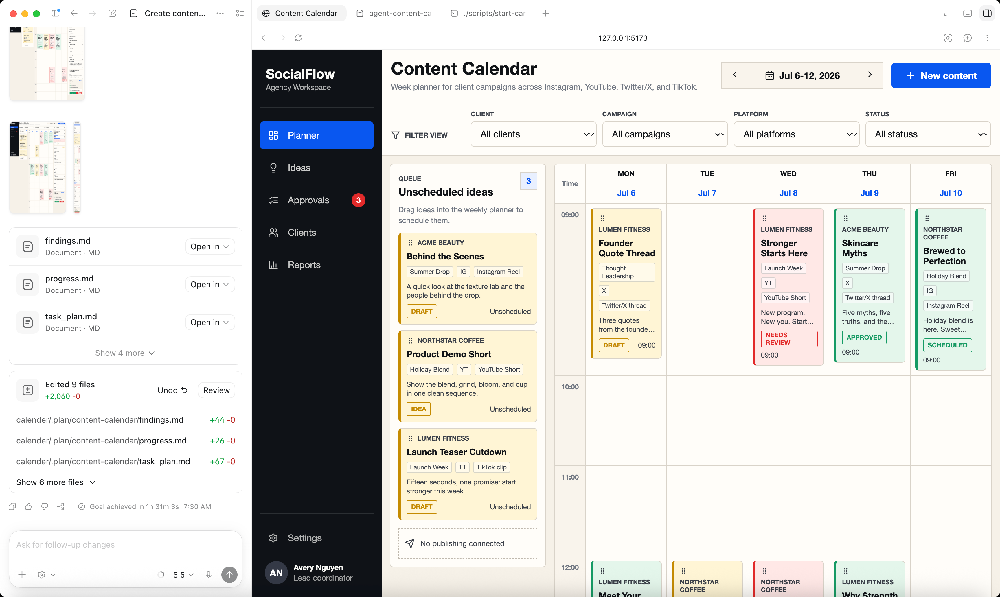

# Proto-me

Proto-me is a product prototype exploration tool for Codex — built to move an idea toward executable implementation. It works through discovery, planning, optional visual design, agent generation, and execution handoff inside the active project context, making every step from idea to implementation visible, editable, and handoff-ready.

## Product Philosophy

The core problem Proto-me solves: how does a rough idea become an executable prototype?

- Break a rough idea into target users, core flow, feature boundaries, key decisions, and done criteria.
- Turn the product brief into the single source of truth for later design, agent generation, and execution.
- Keep visual design optional. Users can generate concept images, UI/UX screens, prototype mockups, vector-style illustrations, posters, or infographics, or skip Design and move directly from Plan to Agent.
- Use generated images as prototype communication assets. Visuals are references for style, hierarchy, experience, and interaction intent; when an image conflicts with the brief, the product brief wins.
- When visual collaboration helps, use the interactive workspace as a shared surface — users can edit text nodes, annotate images, and adjust visual references directly.
- Make execution handoff durable. `proto-plan` turns the confirmed brief and optional visual reference into a durable prototype agent file before Refine and Execute.

The main workflow is:

```text
Explore → Plan → optional Design → Agent → Refine → Execute
```

The progress line keeps the `Design` stage visible, but Design can remain `○`. That means the user has completed Plan and chosen to move directly into Agent.

## Core Capabilities

| Capability | Description |
|---|---|
| Structured product discovery | Organize prototype exploration around `Explore / Plan / optional Design / Agent / Refine / Execute` |
| Product brief distillation | Generate or refresh an editable mind-map + flowchart product brief after product Q&A |
| User intent tracking | Read text from the interactive workspace before the next planning round and treat user edits as current intent |
| Optional visual design | Use `proto-image-gen` to generate prototype visuals; use `proto-image-edit` to revise from annotation screenshots |
| Agent generation & execution | Use `proto-plan` to convert the brief and optional visual reference into an executable agent file |
| Interactive workspace | Open a local workspace when needed for editing the brief, reviewing visuals, annotating, and preserving intermediate artifacts |
| Frontend design execution | Use `proto-frontend-design` to generate distinctive, production-grade frontend interface code |
| File-based task management | Use `proto-planning-with-files` to track task plan, findings, and progress during execution |

## Typical Workflow

### 1. Explore

The user provides a product, feature, page, workflow, or prototype idea. Codex explores the current project to understand existing product shape, constraints, and likely user paths.

### 2. Plan

Codex asks the user to choose a thinking mode:

- **Fast**: Codex can infer low-risk defaults and only ask about key choices.
- **Slow**: Codex asks continuing 3-5 question rounds and does not make product decisions for the user. It keeps going until the user chooses Design / Agent, or until the only remaining questions are low-value and answerable from context.

Q&A produces a concise product brief. When the interactive workspace is available, Codex refreshes the brief as a central node with branches for target users, desired outcomes, user flow, core features/sections/menus, key decisions, remaining unknowns, and done criteria. If the product includes sections or menus, the brief and whiteboard name them explicitly and add one concise child detail block per item. Users can edit and rearrange those nodes directly; later refreshes preserve existing node and arrow layout, update text in place, and add missing items without rebuilding the board.

### 3. Design (Optional)

After Plan, the user has two choices:

- Use `proto-image-gen` to create a visual design.
- Skip Design and call `proto-plan` to enter Agent directly.

`proto-image-gen` is meant for: concept images, UI/UX interface designs, product prototype mockups, vector-style illustrations, flat posters, and infographics. Unless the user asks for one image, Design can generate a consistent visual set for up to five core features, sections, or menus, place each image beside its source node, and connect them with arrows.

After generation, the user can keep refining with `proto-image-edit`, or call `proto-plan` to enter Agent.

### 4. Agent

`proto-plan` writes the product brief and optional Design reference to:

```text
proto-agents/<slug>/agent-<slug>.md
```

If the user skipped Design, the progress line is:

```text
✓ Explore  ✓ Plan  ○ Design  ● Agent  ○ Refine  ○ Execute
```

If the user completed Design first:

```text
✓ Explore  ✓ Plan  ✓ Design  ● Agent  ○ Refine  ○ Execute
```

### 5. Refine

The user can ask Codex to revise the generated agent file. This stage edits only the agent file and does not start implementation.

### 6. Execute

After user confirmation, Codex creates an execution goal and implements the prototype from the agent file. Execution work tracks task plan, findings, and progress in project-local planning files.

## Installation

### Ask Codex To Install It

Send the following message to Codex:

```text
Please install the Proto-me Codex plugin from https://github.com/protome-dev/protome-skills.git.
Clone the repository into ~/marketplace/plugins/proto-me, verify that .codex-plugin/plugin.json exists,
create or update ~/marketplace/.agents/plugins/marketplace.json with marketplace name protome-bundled,
run codex plugin marketplace add ~/marketplace,
then run codex plugin add proto-me@protome-bundled.
After installing, validate the plugin and tell me whether I should start a new conversation to load the new skills and MCP tools.
```

### Manual Install

Clone the plugin into the marketplace root referenced by the Codex protome-bundled marketplace:

```bash
mkdir -p ~/marketplace/plugins
git clone https://github.com/protome-dev/protome-skills.git ~/marketplace/plugins/proto-me
cd ~/marketplace/plugins/proto-me
npm install
npm run build
```

Make sure `~/marketplace/.agents/plugins/marketplace.json` defines the protome-bundled marketplace and contains a Proto-me entry:

```json
{
  "name": "protome-bundled",
  "interface": {
    "displayName": "Proto-me Bundled"
  },
  "plugins": [
    {
      "name": "proto-me",
      "source": {
        "source": "local",
        "path": "./plugins/proto-me"
      },
      "policy": {
        "installation": "AVAILABLE",
        "authentication": "ON_INSTALL"
      },
      "category": "Productivity"
    }
  ]
}
```

Then register the protome-bundled marketplace and install the plugin:

```bash
codex plugin marketplace add ~/marketplace
codex plugin add proto-me@protome-bundled
```

After installing, start a new Codex conversation so the new skills and MCP tools are loaded cleanly.

### Upgrade to Latest Version

#### Ask Codex To Upgrade It

Send the following message to Codex:

```text
Please upgrade the Proto-me Codex plugin installed at ~/marketplace/plugins/proto-me.
Pull the latest changes with git pull --ff-only, run npm install and npm run build,
verify that ~/marketplace/.agents/plugins/marketplace.json uses marketplace name protome-bundled,
then refresh the Codex plugin cache by running codex plugin remove proto-me@protome-bundled
and codex plugin add proto-me@protome-bundled.
After upgrading, validate the plugin and tell me whether I should start a new conversation to load the updated skills and MCP tools.
```

#### Manual Upgrade

Update the local plugin checkout, rebuild it, then reinstall the plugin so Codex refreshes its cached copy:

```bash
cd ~/marketplace/plugins/proto-me
git pull --ff-only
npm install
npm run build
codex plugin remove proto-me@protome-bundled
codex plugin add proto-me@protome-bundled
```

After upgrading, start a new Codex conversation so the updated skills and MCP tools are loaded cleanly.

## Usage

Here is a complete walkthrough using a real example: prototyping a **Content Calendar** to plan and schedule content across Instagram, YouTube, Twitter, and TikTok.

### Step 1 — Start Prototype Explore

In Codex, say:

```text
Use $proto-me to help me prototype a Content Calendar to plan and schedule content across platforms like Instagram, YouTube, Twitter and TikTok.
```

Codex explores the project, identifies constraints, and begins structured product discovery.

### Step 2 — Product Q&A via Canvas

Codex asks you to choose a thinking mode — **Fast** (Codex infers low-risk defaults) or **Slow** (Codex keeps asking 3-5 question rounds until you choose to move on, except when only low-value answerable questions remain). The interactive Canvas workspace opens so you can review and edit the product brief in real time as Q&A progresses.


### Step 3 — Generate Visual Design

After the brief is ready, ask Codex to generate visual design concepts:

```text
Use $proto-image-gen to generate UI designs for the Content Calendar.
```

Codex creates a consistent visual set for the core features and places each image beside its source node in the Canvas.


### Step 4 — Generate Agent Plan

Once you are satisfied with the brief and optional visuals, Codex generates an executable prototype agent file that captures every requirement, flow, and design reference.

```text
Use $proto-plan to generate the prototype agent from the current brief.
```



### Step 5 — Execute via Codex Goal

After reviewing and refining the agent file, Codex creates an execution goal and begins implementing the prototype. Progress is tracked in project-local planning files.



### Step 6 — First Prototype Result

Codex delivers the first working version of the Content Calendar prototype — a fully functional starting point you can iterate on.



## Skills

### Core Discovery Flow

| Skill | Description |
|---|---|
| `proto-me` | Start product prototype discovery, complete Explore and Plan, then offer optional Design or direct Agent handoff |
| `proto-plan` | Generate a durable prototype agent file from the product brief and optional design reference |
| `proto-brainstorming` | Explore user intent, requirements, and design through collaborative dialogue before any creative work |

### Visual Design

| Skill | Description |
|---|---|
| `proto-image-gen` | Generate prototype visual designs, usually as up to five connected feature/section/menu visuals, or as one image for an explicitly targeted holder |
| `proto-image-edit` | Revise prototype visuals from user-provided annotation screenshots and place each result beside its original |
| `proto-frontend-design` | Generate distinctive, production-grade frontend interface code that avoids generic AI aesthetics |

### Workspace & Execution

| Skill | Description |
|---|---|
| `proto-open-canvas` | Open the local Proto-me interactive workspace for editing briefs, reviewing visuals, and making annotations |
| `proto-planning-with-files` | Track task plan, findings, and progress for complex execution work |

## Data Layout

Proto-me writes workspace data to the active user project, not to the plugin repository:

```text
canvas/<slug>/
  proto-me-runtime.json
  proto-me-selection.json
  proto-me-view-state.json
  pages/
    <page-id>/
      proto-me-canvas.json
      assets/
```

Create `<slug>` from the product or feature name: 2-5 word kebab-case, lowercase letters, numbers, and hyphens only, no leading or trailing hyphens, max 50 chars.

Agent files are written to:

```text
proto-agents/<slug>/agent-<slug>.md
```

Execution-stage task notes usually live under:

```text
.plan/<slug>/
```

## Local Development

```bash
npm install
npm run dev
npm run build
```

You can also start the workspace service directly and pass the active user project directory:

```bash
./scripts/start-canvas.sh /path/to/user/project <slug>
```

Useful environment variables:

| Variable | Description |
|---|---|
| `PROTO_ME_PORT` | Local service port, default `43217`. If busy, Vite uses a fallback port and writes the actual URL to `proto-me-runtime.json` |
| `PROTO_ME_PROJECT_DIR` | The user project directory that owns the workspace data |
| `PROTO_ME_CANVAS_SLUG` | Product or feature slug. When set, the default data directory is `$PROTO_ME_PROJECT_DIR/canvas/$PROTO_ME_CANVAS_SLUG` |
| `PROTO_ME_CANVAS_DIR` | Data directory. When set, this overrides the directory derived from `PROTO_ME_CANVAS_SLUG` |

## Developer

Lena Doll  
lenadoll@protome.dev  
https://www.protome.dev

## Acknowledgements

Proto-me's interactive workspace is built on top of [tldraw/tldraw](https://github.com/tldraw/tldraw).
